# Chapter 5: One Loop Every 198 Days (Execution Mechanics)

## Core Idea
Semiconductor progress is measured in foundry cycles, not calendar milestones. A full iteration comprises a 30-day repeatable digital design sprint and an unalterable 168-day physical foundry manufacturing window (totaling 198 days).

---

## The Dual-Clock Silicon Engine

```mermaid
gantt
    title The 198-Day Execution Loop
    dateFormat  X
    axisFormat %d d
    section Digital Design (Controllable)
    Architecture & Spec       :a1, 0, 12
    RTL & Synthesis (Yosys)   :a2, 12, 18
    Verification & P&R        :a3, 18, 25
    DRC / LVS & Tapeout Gate  :crit, a4, 25, 30
    section Foundry Fabrication (Fixed Calendar)
    Photomask Generation      :b1, 30, 60
    Wafer Fab (SkyWater)      :b2, 60, 150
    Dicing & Packaging (QFN)  :b3, 150, 180
    Silicon Test & Bring-up   :b4, 180, 198
```

### The Two Speeds of Silicon Development
1. **Digital Blocks (1 Cycle = 198 Days)**:
   - Automated RTL-to-GDSII tools enable full verification and layout in under 30 days.
   - First-pass silicon success is high because digital logic is exhaustively verified on FPGAs and logic simulators.
2. **Analog & Mixed-Signal Blocks (2–3 Cycles = 14–24 Months)**:
   - Analog circuits (bandgaps, LDMOS power stages, 15kV ESD rings, SiGe 77GHz RF) cannot be fully verified in simulation or on FPGAs.
   - Require real physical silicon in hand to measure temperature drift, substrate noise, and latch-up.
   - *Strategic Rule*: Mostly digital chips (Chip 1 Motor Controller, Chip 2 Smart Meter) tape out in Cycle 1 to generate early commercial revenue while complex analog parts iterate through Cycles 2 and 3.

---

## The Foundry Shuttle Calendar (CI2609 & CI2612)

| Shuttle Identifier | Reservation Deadline | Tapeout (GDSII) Due | Packaged Silicon Arrival | Lead Time | Target SKUs |
|---|---|---|---|---|---|
| **CI2609** | 5 Aug 2026 | 16 Sep 2026 | **3 Mar 2027** | 168 Days | Chip 1 (Motor), Chip 2 (Meter), Chip 3 (Power) |
| **CI2612** | 8 Oct 2026 | 7 Dec 2026 | **25 May 2027** | 168 Days | Chip 4 (Lockstep), Chip 5 (Transceiver), Chip 6 (Supervisor) |

---

## The Post-Silicon Productization Lag
Silicon-in-hand does **not** equal a commercial product. The post-silicon schedule cannot be compressed with capital:
- **Commercial / Industrial Qualification**: Adds **6–9 months** (Characterisation across PVT corners, datasheet authoring, evaluation board production, ATE test program development).
- **Screened Defence Qualification**: Adds **9–12 months** (MIL-STD-883 burn-in, JSS environmental screening, CEMILAC flight clearance certification).

---

## Key Takeaways
1. Design takes ≤30 days, but foundry wafer fabrication and packaging take a rigid 168 days.
2. Missing a foundry shuttle cutoff delays the company by 6 full months.
3. Digital chips ship within 1 cycle; analog chips require 2–3 successive tapeouts.

---

## Connects To
- **Ch 10**: Qualification, screening, and ATE test engineering.
- **Ch 13**: Foundry shuttle capex budgeting and milestone dates.
