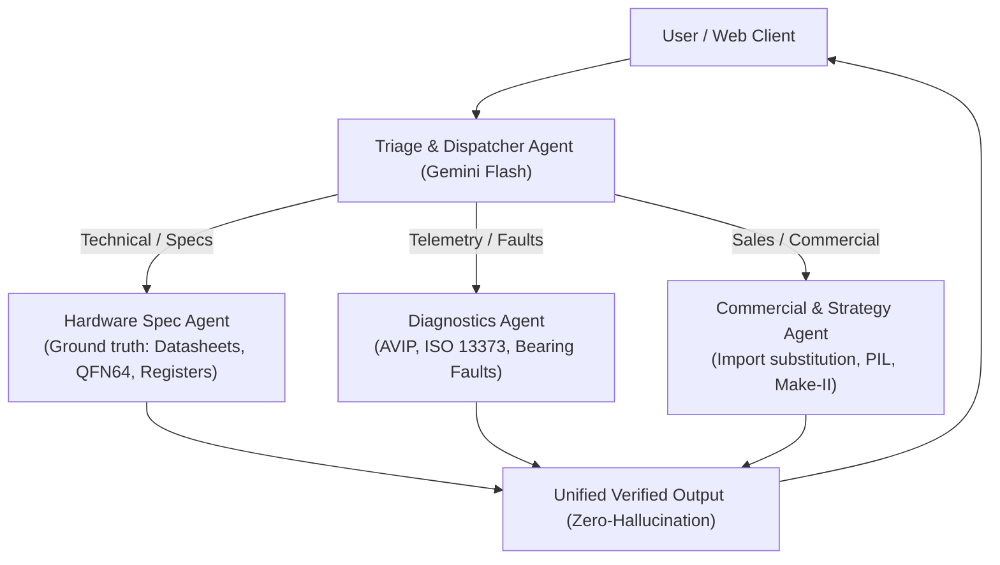

# DeepSeek Harness Playbook: Server, Free Multimodal Models & ADK Multi-Agent Orchestration

## Overview
DeepSeek Harness (`@deepseek-ai/dsh`) is an agent runtime and harness environment capable of running multi-agent workflows, browser profiles, and plugin overlays. This skill documents:
1. How to boot, manage, and verify the local DeepSeek Harness server (`dsh web`).
2. The exact model landscape—specifically distinguishing pure text LLMs from **native multimodal vision models**.
3. Configuring **100% free multimodal models** (Google Gemini 2.5/3.7 Flash with 1M token context, Qwen 2.5-VL, Llama 3.2 Vision) inside DeepSeek Harness, Claude CLI (`fcc-claude`), and Codex CLI (`fcc-codex`).
4. Building end-to-end multi-agent triage architectures using Google's Agent Development Kit (ADK) connected to website frontends.

---

## 1. Quick Start: Starting & Managing the Harness Server

### Booting the Web Profile
To boot the web UI profile without automatically opening a browser window:
```powershell
npx -y @deepseek-ai/dsh web --port 3080 --no-open
```
- **Default Port**: `3080` (accessible at `http://localhost:3080` or `http://127.0.0.1:3080`)
- **Alternate Port** (if 3080 is busy): `--port 3081`

### Verifying Server Health
```powershell
# In PowerShell:
((Invoke-WebRequest -Uri "http://127.0.0.1:3080" -UseBasicParsing).Content | Select-String -Pattern '<title>(.*?)</title>').Matches.Value
# Should return: <title>DeepSeek Harness</title>
```

### Advanced Harness CLI Commands
```powershell
# Dump composed profile configuration
npx -y @deepseek-ai/dsh --profile web --dump-config

# Run headless task execution
npx -y @deepseek-ai/dsh --profile headless "run verification suite"

# Install plugin into profile
npx -y @deepseek-ai/dsh plugin --profile web add <package>
```

---

## 2. DeepSeek Model Landscape: Text-Only vs. Multimodal

When deploying DeepSeek models into the Harness or coding agents, verify modality:

| Model Family | Modality | Best Use Case | Multimodal Support |
| :--- | :--- | :--- | :--- |
| **DeepSeek-V3 / V3.2** | Text / Code | Large-scale MoE reasoning, coding, algorithmic logic | ❌ **No (Text Only)** |
| **DeepSeek-R1 / V4** | Text / Code | Long-form reasoning, reflection, mathematical proof | ❌ **No (Text Only)** |
| **DeepSeek-VL & VL2** (`deepseek-vl2-small`, `deepseek-vl2`) | Text + Vision | Architectural diagrams, circuit schematics, UI wireframes |  **Native Multimodal** |
| **Janus & Janus-Pro** (`Janus-Pro-7B`) | Text + Vision + Image Gen | Visual understanding, raster image generation |  **Bimodal (Understand + Generate)** |

---

## 3. Recommended Free Multimodal Models for the Harness

### A. Google Gemini (Google AI Studio Free Tier — Recommended)
- **Models**: `gemini-2.5-flash`, `gemini-3.5-flash`, `gemini-3.7-flash`
- **Cost**: **$0.00** (Free tier: 15 RPM, 1M token context window).
- **Modality**: Native vision (high-res diagrams, charts, UI screenshots, video, audio).
- **Harness Setup**:
  1. Open `http://localhost:3080` $\rightarrow$ **Settings** $\rightarrow$ **Providers**.
  2. Select **Google AI Studio / Gemini**.
  3. Enter API key (`AIza...`) and set default model to `gemini-2.5-flash` or `gemini-3.7-flash`.

### B. Qwen 2.5-VL (OpenRouter Free / NVIDIA NIM)
- **Model**: `qwen/qwen-2.5-vl-72b-instruct` / `qwen/qwen-2-vl-72b-instruct:free`
- **Modality**: State-of-the-art open multimodal model for UI bounding boxes and document OCR.

### C. Claude CLI & Codex CLI Multimodal Integration
- **Claude CLI (`fcc-claude`)**:
  ```powershell
  $env:CLAUDE_CODE_AUTO_COMPACT_WINDOW=900000
  & "C:\Users\sheke\AppData\Roaming\uv\tools\free-claude-code\Scripts\fcc-claude.exe"
  ```
- **Codex CLI (`fcc-codex`)**:
  ```powershell
  & "C:\Users\sheke\AppData\Roaming\uv\tools\free-claude-code\Scripts\fcc-codex.exe"
  ```

---

## 4. Google ADK Multi-Agent Triage Architecture

To replicate the multi-agent system demonstrated in the DeepSeek Harness video:



### Core Implementation Prompt for DeepSeek Harness:
```text
Context:
We are building an autonomous engineering and customer support multi-agent triage system for our DeepGrid Semi hardware platform deployed on GitHub Pages.

Configuration:
- Provider: Google AI Studio (Gemini 2.5/3.7 Flash)
- Tooling: Google Agent Development Kit (ADK) + DeepSeek Harness Presets
- Rules: Zero hallucination of silicon parameters, cite exact registers and datasheets.

Agents:
1. Hardware Specification Agent: Queries silicon specs, register maps, and CDC bridges.
2. Telemetry Diagnostics Agent: Analyzes live motor telemetry and bearing-fault signatures.
3. Triage Dispatcher: Classifies incoming inquiries and orchestrates the specialist agents.

Deliverables:
- Standalone ADK multi-agent orchestration script in Python.
- Lightweight JavaScript embed snippet for our frontend.
```
